# Shared Data Sample - Enable sharing of data within or across flows in the application

# Description

This is Shared Data activity sample.The SharedData activity enables sharing of runtime data within a flow or across flows in an app.The advantage of using this feature is that you can set data anywhere in the main flow, subflow, or error handler and the data can be shared across the entire flow or app.

## Copy App 

1. Copy the GetUsersInfo.flogo app into your workspace.

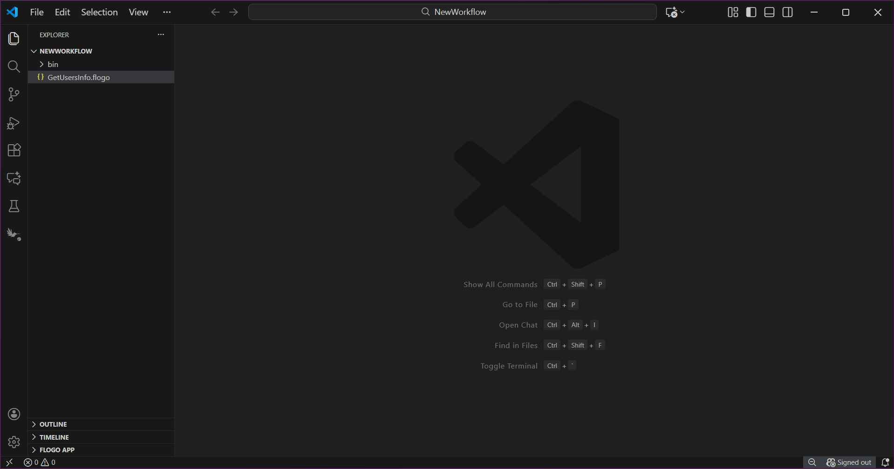

## Understanding the configuration

In the GetUsersInfo.flogo sample, there are 3 flows: *Set_Get_User1_Set_User2*, *Get_User2*, and *Get_User1_User2_Delete_User2*.

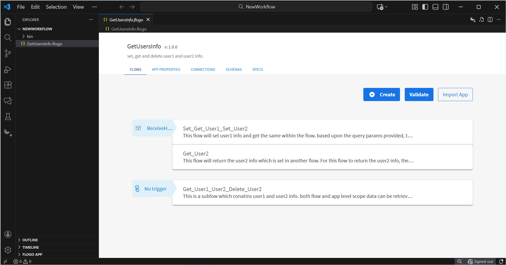

First flow which is *Set_Get_User1_Set_User2* sets the information about User1 in *flow* level scope with key *user1*.  

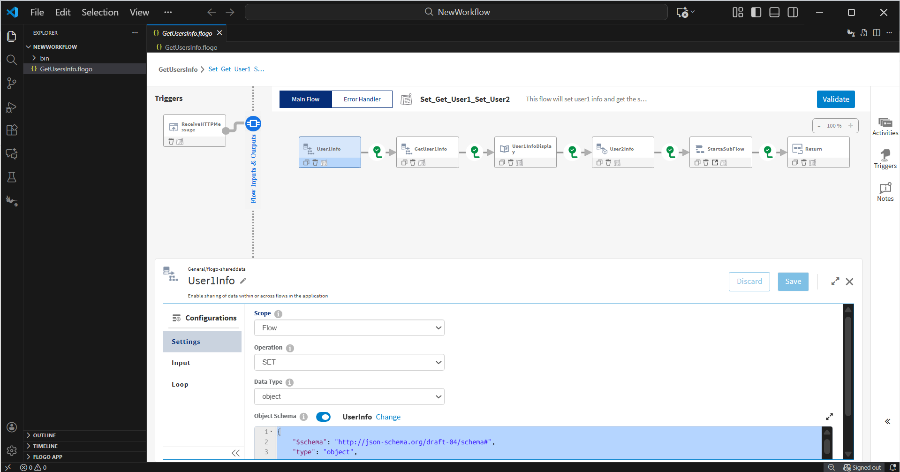

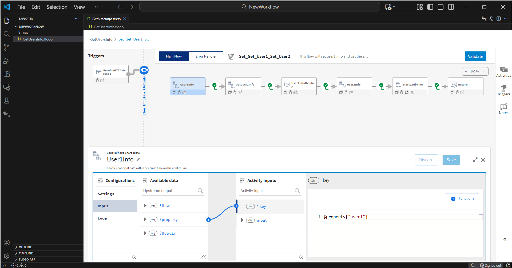

To get the User1 information in the same flow, the Get operation is used with the same key (*user1*).

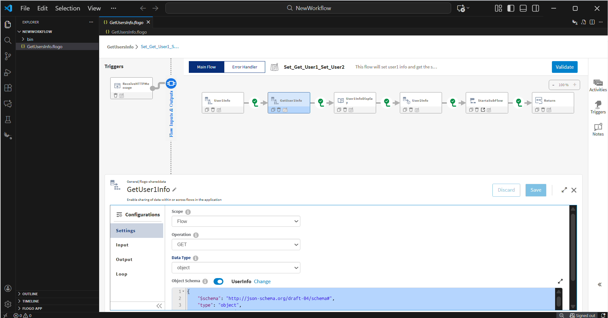

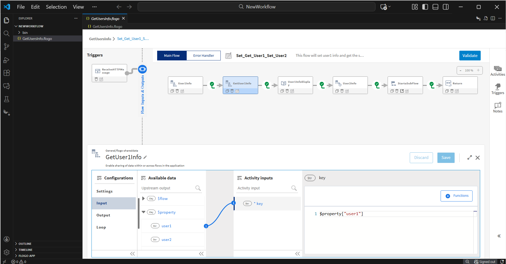

The flow also sets the User2 information with the *application* level scope with key *user2* and call a subflow *Get_User1_User2_Delete_User2*.

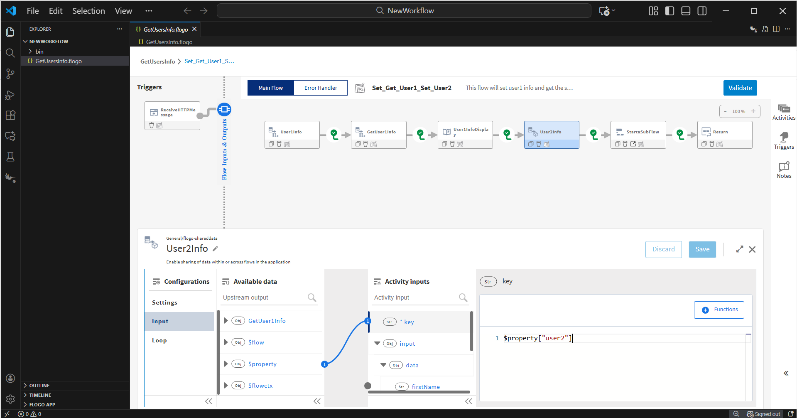

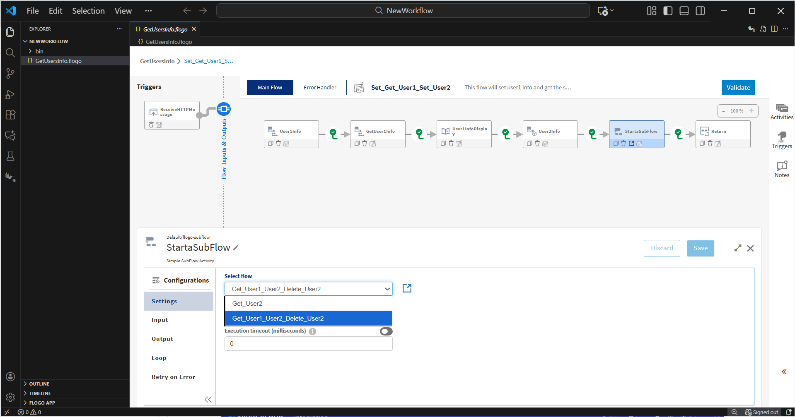

The flow *Get_User2* is another flow which gets the User2 information set in flow *Set_Get_User1_Set_User2*.

The flow *Get_User1_User2_Delete_User2* is a subflow to the main flow *Set_Get_User1_Set_User2* and gets the User1 information as well as User2 information based upon the input provided to the subflow. The input to the subflow is the same key which was set for user1 and user2 information.

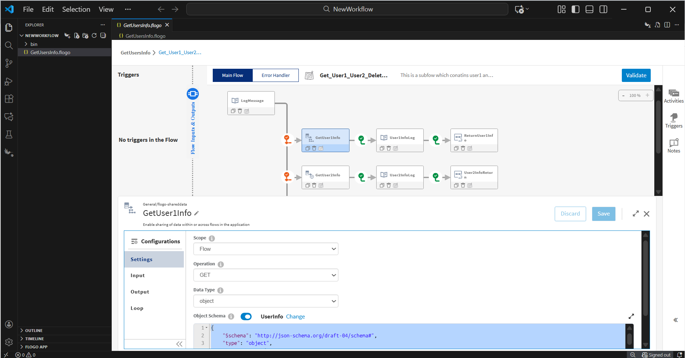

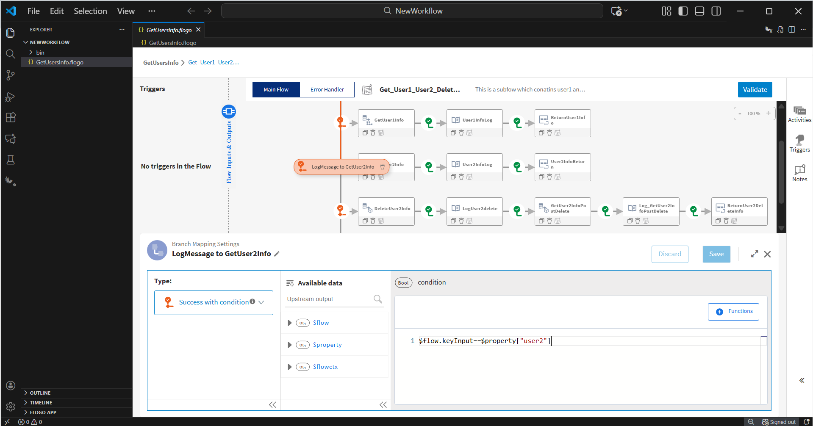

 
The flow also includes *Delete* operation for the User2 information which is  set at the *application* level scope. Based upon the *keyInput* and *isDelete* parameters from user, the respective user's information and operation will be performed.
For example, If user gives *keyInput* as "user2" and *isDelete* as true. The operation Delete will be performed on the User2 information. The same will be returned by the subflow *Get_User1_User2_Delete_User2* to the main flow *Set_Get_User1_Set_User2*.

[Branch Condition Of Delete User2](../../images/flow-design-concepts/shared-data/BranchConditionOfDeleteUser2.png)

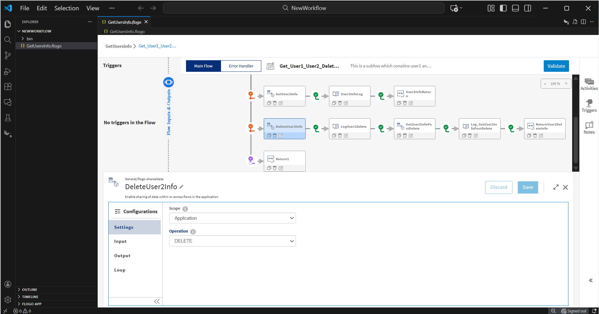

### Run the application

Once you are ready to run the application, you can use run option and then run this app. Once it reaches to Running state, go to API tester and hit tryout the endpoints.

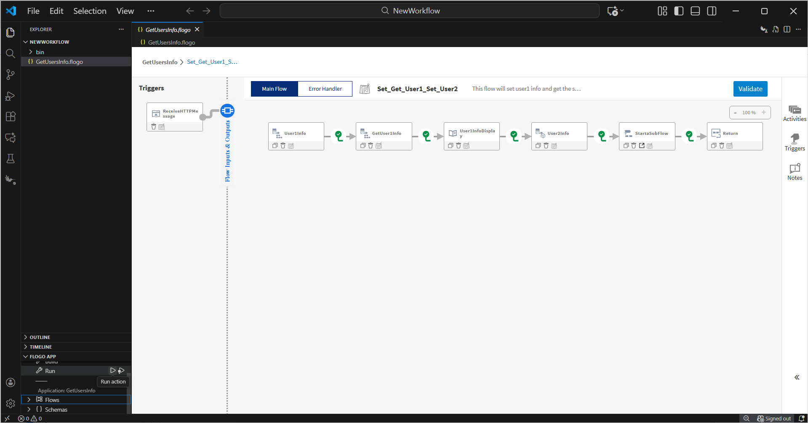

For Flow 1 use below endpoints

http://localhost:9999/user/user1

http://localhost:9999/user/user2

For Flow 2 use below endpoint

http://localhost:9999/users2

## Outputs

1. Terminal Logs

Logs Of Flow 1

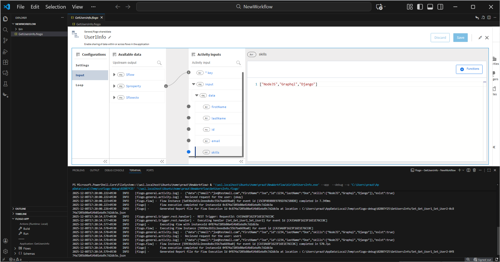

Logs Of Flow 2

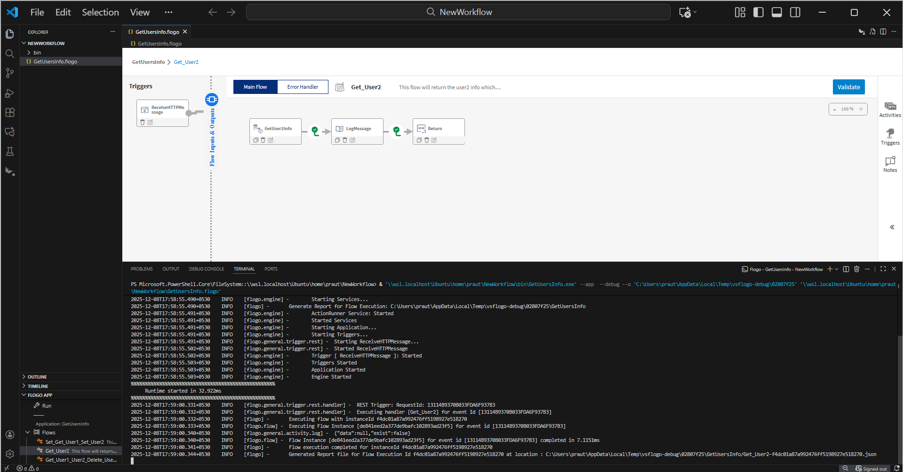

2. When hit endpoints

Flow 1 Out put.

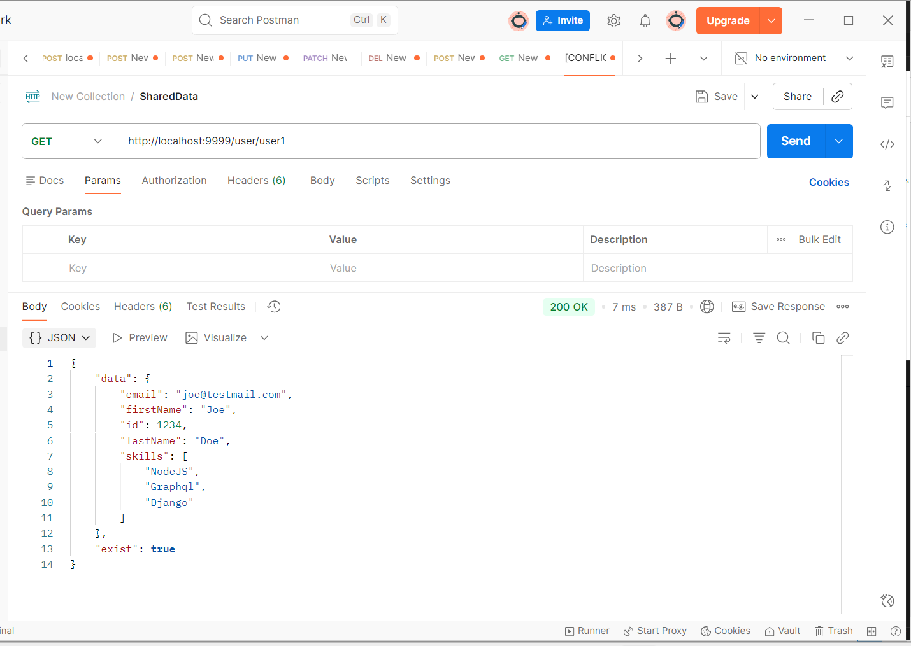

Flow 2 Out put.

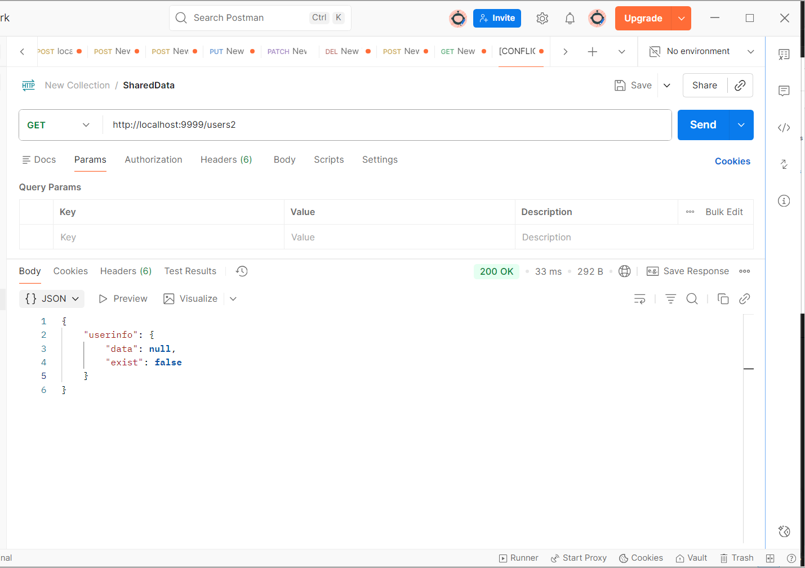

## Help

Please visit our [TIBCO Flogo&trade; Extension for Visual Studio Code documentation](https://docs.tibco.com/pub/flogo-vscode/1.3.4/doc/html/Default.htm#flogo-vscode-user-guide/app-development/general-triggers/shared-data.htm?TocPath=User%2520Guide%257CApp%2520Development%257CGeneral%2520Category%2520Triggers%252C%2520Activities%252C%2520and%2520Connections%257CActivities%257C_____16) for additional information.